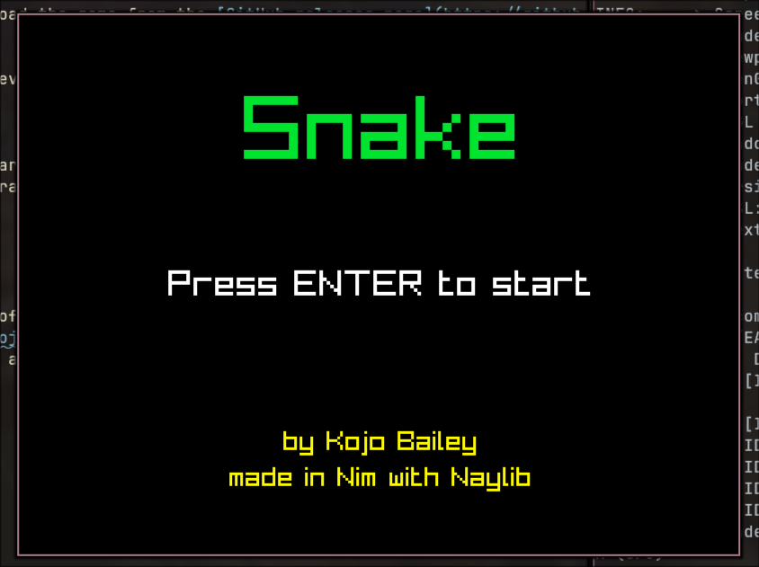
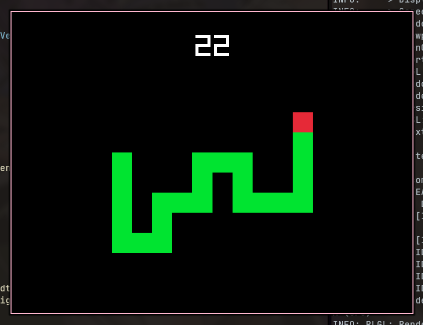

# Snake - Nim

Here is an implementation of the classic **Snake** videogame in the [Nim](https://nim-lang.org) programming language using Raylib - more specifically, the [Naylib wrapping](https://github.com/planetis-m/naylib).

This is my first time using Nim, as this was my excuse to try out the language. Overall, it took about 4 hours straight to get to v1.0.0. It's unlikely I'll update it further though.

## Installation
If you're on modern Linux, you can download the game from the [GitHub releases page](https://github.com/KojoBailey/snake-nim/releases).

If you want to build from source, I believe Nim is cross-platform, so just clone this project and compile it with Nimble or whatever.

## How To Play
Use your arrow keys to move the green character (the snake) to eat the red squares (apples). If you crash into the walls, you die. If you crash into yourself, you die. You cannot move directly backwards either.

How high of a score can you get?

## Bugs
There are currently no bugs that I know of, but if you do happen to spot any, please let me know by opening an [issue](https://github.com/KojoBailey/snake-nim/issues). Pull requests are also welcome if you so wish, although I will only be accepting bug fixes.

## Reflections
I wrote a blog post detailing my thoughts on Nim after making this project. Check it out!

https://kojobailey.me/posts/first-date-with-nim/
